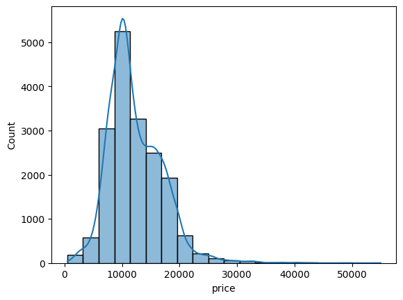
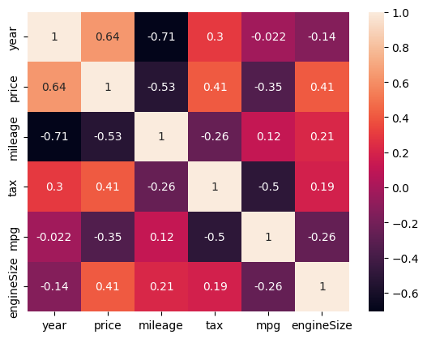

# Ford Car Price Prediction

A machine learning project to predict car prices using linear regression with various car features.                 
Dataset has been collected from Kaggle -- https://www.kaggle.com/datasets/adhurimquku/ford-car-price-prediction

## Dataset

The model is trained on Ford vehicle data (`ford.csv`) with the following features:
- **Engine Size**: Displacement of the engine
- **MPG**: Miles per gallon (fuel efficiency)
- **Tax**: Annual tax amount
- **Mileage**: Total distance traveled
- **Year**: Year of manufacture
- **Transmission Type**: Manual or Semi-Auto
- **Fuel Type**: Petrol or Diesel
- **Model**: Various Ford models

## Model Performance

| Metric | Value |
|--------|-------|
| **R² Score** | 0.8259 (82.59%) |
| **Adjusted R²** | 0.8244 (82.44%) |

The model explains approximately **82.6%** of the variance in car prices, indicating a strong predictive performance.

## Data Exploration

### Price Distribution
The histogram below shows the distribution of car prices in the dataset:

### Feature Correlation
The heatmap below illustrates the correlation between different features:

## Key Findings

- **Year** and **Price** show strong positive correlation
- **Mileage** has a negative correlation with price (higher mileage = lower price)
- **Engine Size** and **Tax** are important predictors
- **MPG** affects pricing based on vehicle efficiency

## Model Approach

1. **Data Preprocessing**: Handled duplicates and missing values
2. **Feature Engineering**: One-hot encoding for categorical variables, standardization of numerical features
3. **Feature Selection**: Used mutual information regression for feature importance
4. **Model**: Linear Regression with train-test split (80-20)
5. **Evaluation**: R² and Adjusted R² metrics
